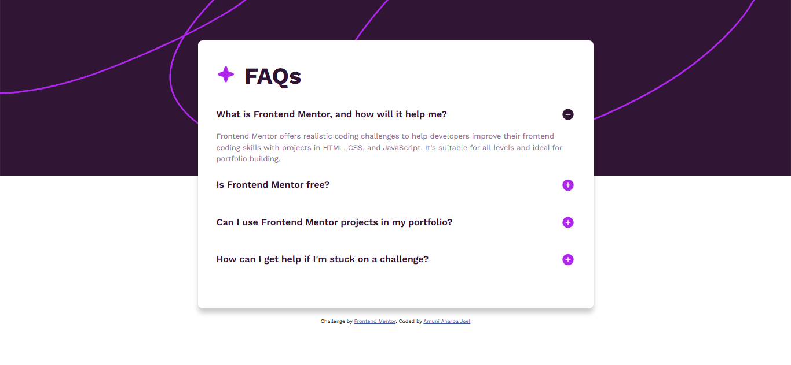

# Frontend Mentor - FAQ accordion solution

This is my solution to the [FAQ accordion challenge on Frontend Mentor](https://www.frontendmentor.io/challenges/faq-accordion-wyfFdeBwBz). This project helped me practice building interactive components using JavaScript and improving my responsive design skills with HTML and CSS.

## Table of contents

- [Overview](#overview)
  - [The challenge](#the-challenge)
  - [Screenshot](#screenshot)
  - [Links](#links)
- [My process](#my-process)
  - [Built with](#built-with)
  - [What I learned](#what-i-learned)
  - [Continued development](#continued-development)
  - [Useful resources](#useful-resources)
- [Author](#author)
- [Acknowledgments](#acknowledgments)

**Note: Delete this note and update the table of contents based on what sections you keep.**

## Overview

### The challenge

Users should be able to:

- Hide/Show the answer to a question when the question is clicked
- Navigate the questions and hide/show answers using keyboard navigation alone
- View the optimal layout for the interface depending on their device's screen size
- See hover and focus states for all interactive elements on the page

### Screenshot



### Links

- Solution URL: [https://github.com/joelanarba/faq-accordion](https://github.com/joelanarba/faq-accordion)
- Live Site URL: [https://joelanarba.github.io/faq-accordion/](https://joelanarba.github.io/faq-accordion/)

## My process

### Built with

- Semantic HTML5 markup
- CSS custom properties
- Flexbox
- CSS Grid
- Mobile-first workflow
- JavaScript (DOM manipulation & event handling)

### What I learned

This project reinforced my understanding of:

- Dynamic UI interactions using JavaScript

- Event delegation for better performance

- Keyboard accessibility using the tab and keydown events

- CSS hover & focus states to enhance user experience

Example of the JavaScript logic I used for opening/closing FAQs:
```js
const faqs = document.querySelectorAll('.faq');

faqs.forEach((faq) => {
    const title = faq.querySelector('.faq-title');
    const answer = faq.querySelector('.faq-answer');

    title.addEventListener('click', () => {
        faqs.forEach((item) => {
            if (item !== faq) {
                item.classList.remove('open');
            }
        });
        faq.classList.toggle('open');
    });
});
```
This ensures that only one FAQ is open at a time while toggling the clicked one.

### Continued development

Moving forward, I want to:

- Improve my JavaScript skills by handling more complex UI interactions
- Experiment with CSS animations for smoother transitions
- Enhance accessibility by improving keyboard navigation

### Useful resources

- [MDN Web Docs - JavaScript Event Handling](https://developer.mozilla.org/en-US/docs/Web/Events) - Helped me understand how to properly handle user interactions.

## Author

- Frontend Mentor - [@joelanarba](https://www.frontendmentor.io/profile/joelanarba) 
- GitHub - [@joelanarba](https://github.com/joelanarba)
- LinkedIn - [@joelanarba](https://www.linkedin.com/in/joelanarba/)
- Twitter - [@joel_anarba](https://x.com/joel_anarba)

## Acknowledgments

A big thank you to the Frontend Mentor community for providing great challenges! Also, shoutout to everyone sharing tips and solutions—it’s always great to learn from others. 